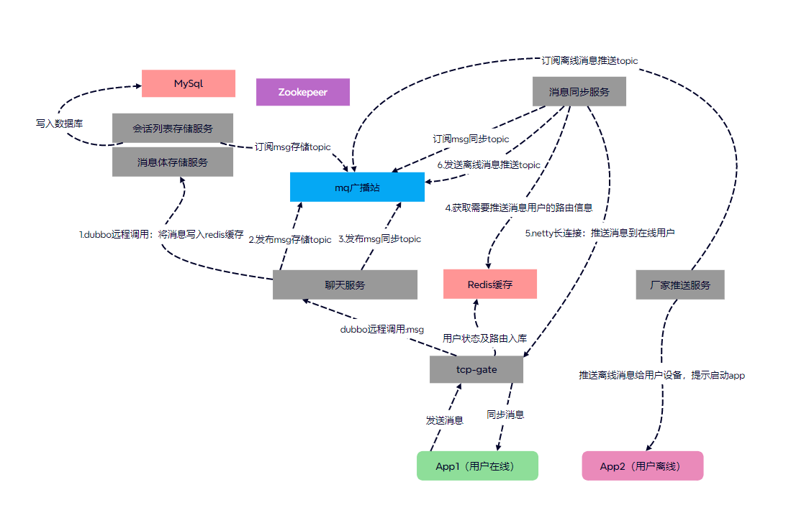

#### 服务端架构如下：
- 前台服务：http服务、tcp服务，
- 后台服务：auth（校验token）服务、message服务（存储消息体）、chatlist服务（存储会话列表）、sync消息同步服务、chat-server聊天中转服务、account服务(处理玩家信息服务)、push-Server离线消息推送服务
- 1、使用gin搭建web服务，接收客户端http请求、例如登录、注册、加载好友列表、新建群聊、添加删除好友等
- 2、搭建tcp服务接收客户端长连接，接收客户端tcp消息
- 3、搭建auth鉴权服务，为每一个用户生成唯一的token，拦截http请求，检测token的合法性
- 4、使用dubbogo做远程服务调用，zookepeer做注册中心
- 5、使用nats消息队列中间件，发布订阅消息
- 6、使用go-ent做访问mysql数据存储中间件
- 7、使用redis-go做访问redis中间件
- 8、使用七牛云存储图片、语音、视频消息内容
#### 项目具体流程：
- 1、客户端登录http服务之后，根据本地保存的最新syncpos同步消息位置，主动向服务器发起同步消息分批请求，http服务通过dubbogo远程调用sync服务，同步数据成功后，客户端带上token数据登录tcp服务建立长连接，将登录的设备信息写入到redis缓存。同步失败，客户端继续尝试同步数据。
- 2、客户端发送消息给tcp服务，tcp服务校验消息的合法性之后，通过dubbogo调用chat-server服务
- 3、chat-server收到聊天消息后，在redis中获取用户当前会话的最新消息在消息管道中的位置，自增一个值，设置给消息体。chat-server使用雪花算法，使用当前服务在zookepeer中唯一的workId
生成全服唯一的msgId，设置给消息体，并将消息体写入redis，将消息id与消息在管道中的位置对应关系写入redis,chat-server通过nats广播消息
- 4、message服务订阅chat-server广播的聊天消息，将消息体写入数据库,chatlist服务订阅chat-server广播的聊天消息，将会话列表服务更新当前会话最新的消息
- 5、对于在线用户，chat-server根据redis中保存的用户登录的设备信息，远程调用tcp服务，tcp服务将消息推送给设备。对于离线用户，chat-server远程调用push-server通过商家推送服务，将离线消息推送给具体设备。
#### 客户端架构：
-  1、使用dio发起http请求，socket做tcp连接
-  2、使用sqflite本地保存玩家登录profile信息、聊天消息列表、会话列表
-  3、使用stream发布订阅消息，比如将服务器推送的聊天消息，全局广播，不同的页面订阅通知，收到消息后做不同的处理
-  4、使用network_image插件缓存图片文件到app运行目录
-  5、使用image_picker获取相册图片、拍摄视频，photo_view预览图片、image_cropper裁剪图片、video_thumbnail获取视频第一帧作为封面图片、video_player、chewie播放视频、flutter_sound制作音频、播放音频
-  6、使用permission_handler获取应用权限
-  7、使用flutter_localizations做国际化处理